# Decimal 64-bit Floating-Point Machine

A web app for our CSARCH2 case study that encodes and computes with IEEE
754-2008 `decimal64` numbers.

- **Course:** CSARCH2, Section S01
- **Group:** Group 9
- **Repo:** https://github.com/otappytaps/decimal-64-bit-fp-machine
- **Demo video:** https://youtu.be/74KgVZBTCjI
- **Live site:** https://otappytaps.github.io/decimal-64-bit-fp-machine/

**Members:** Adrian Co, Tyrone Lee, Kyle Tiu, Zach Hallare, David Javier

---

## Overview

Computers usually store fractional numbers in binary, which is great for
speed but unreliable for precision.

`decimal64` is IEEE's solution for that, which is a 64-bit format that represents numbers
in base 10 instead, so decimal values actually stay decimal in memory too. It's part of the
IEEE 754-2008 standard, and you'll find it used in places like financial software and databases
where accuracy is paramount.

This web application aims to further the understanding of the format which consists of the following windows:

- a **decimal → decimal64 converter**
- a **rounding method comparison** (see all 4 approaches side by side)
- a **GRS arithmetic engine** that does subtraction and division directly on
  decimal64 values, with full working shown

## Running it yourself

You'll need **Node.js 20+** and **npm**.

```bash
git clone https://github.com/otappytaps/decimal-64-bit-fp-machine.git
cd decimal-64-bit-fp-machine
npm install
npm run dev
```

That last command starts Vite's dev server — it'll print out a local address
(usually `http://localhost:5173`), open that in your browser. `Ctrl+C` when
you're done.

A couple other scripts you might want:

```bash
npm run lint     # Oxlint
npm run build    # type-checks + builds for production
npm run preview  # serves the production build locally
```

## Windows

### 1. Decimal → Decimal64 Converter

Type in a decimal number (fractions are fine) and, optionally, a power-of-ten
exponent. The converter builds the encoding piece by piece:

- figures out the sign bit (negative = `1`)
- normalizes your input to a 16-digit coefficient — if you give it more
  digits than that, it truncates and bumps the exponent to compensate
- biases the true exponent by `398` so it fits as an unsigned 10-bit field
  (`e' = e + 398`)
- builds the 5-bit combination field out of the exponent's top 2 bits and the
  leading digit — there's a different bit pattern depending on whether that
  leading digit is 0–7 or 8–9
- chops the remaining 15 digits into 5 groups of 3, and DPD-encodes each
  group into 10 bits

If the exponent goes past what the format can hold (biased value over `767`),
you get ±Infinity back. Go below `0` and it underflows to ±0 instead.

You get the full 64-bit string (labeled by section: sign / combination /
exponent / coefficient), the hex equivalent, and a banner if something
special happened (NaN, infinity, etc).

### 2. Rounding Comparison

Give it a number (decimal or binary) and how many digits
past the decimal point you want to keep, and it runs all four rounding
methods on it at once so you can compare:

- **Chopped** — just cuts off the extra digits
- **Rounded up / down** — shifts the decimal point, applies `ceil`/`floor`,
  shifts back
- **Ties-to-even** — exact `.5` values round toward
  whichever neighbor makes the last digit even

If you ask for a negative number
of digits, or more digits than the number actually has, it'll throw an error

### 3. GRS Arithmetic (Subtraction & Division)

Give it two operands — decimal or
IEEE hex — pick subtraction or division, and it walks through the entire
calculation the way you'd do it by hand with Guard, Round, and Sticky bits.

For **subtraction**, the operand with the smaller exponent gets its
significand shifted right to line up with the other one, and the GRS digits
get pulled out during that shift. Then it's just `A + (−B)`, followed by
normalizing, rounding (ties-to-even, using the GRS digits), and — if the
coefficient grew past 16 digits — renormalizing again.

**Division** works a bit differently under the hood: the numerator gets
scaled up by `10^18` before dividing, which gives enough precision that the
GRS digits can be read straight off the quotient and remainder. Exponents
subtract separately, then it's the same normalize → round → renormalize
routine as subtraction.

Before any of that runs, it checks for the usual edge cases — NaN stays NaN,
`∞ − ∞` and `0 ÷ 0` both become NaN, dividing by zero gives ±Infinity, and
dividing by infinity gives ±0. Same overflow/underflow exponent limits apply
here too (`767` / `0`).

What you get back: the whole step-by-step trace, plus the final answer in
scientific notation, binary, and hex.

## What each input field actually accepts

| Field                        | Format                                                       |
| ---------------------------- | ------------------------------------------------------------ |
| Converter — decimal input    | Signed base-10, decimals allowed                             |
| Converter — exponent         | Signed base-10 integer                                       |
| Arithmetic — decimal operand | Signed base-10, `e`-notation OK (`-1.23e5`)                  |
| Arithmetic — hex operand     | Exactly 16 hex chars (64 bits), `0x` optional                |
| Rounding — number            | Decimal or binary, sign and fraction optional                |
| Rounding — target digits     | 0 or higher, can't exceed the number's actual decimal digits |

Anything invalid gets flagged right next to the field — we don't clear out
what you typed, so you can just fix it and resubmit.

## Program Structure

```text
index.html                    Vite HTML entry point
package.json                  Project metadata and scripts
vite.config.ts                Vite and Tailwind plugin configuration
src/
  main.tsx                    React entry point
  index.css                   Tailwind import and cyberpunk theme
  components/
    App.tsx                   Root layout assembling the three windows
    Banner.tsx                Page title and tagline
    ConvertWindow.tsx         Decimal to Decimal64 converter UI
    RoundingWindow.tsx        Rounding methods UI
    ArithmeticWindow.tsx      GRS arithmetic UI
    arithmetic/
      types.ts                Shared step, part, and operand types
      format.ts                Scientific-notation and binary/hex formatting
      dpd.ts                   DPD 10-bit group encoding and decoding
      decimal64Codec.ts       Decimal64 bit parsing and encoding
      inputParsers.ts         Decimal and IEEE-hex input validation
      grs.ts                   GRS rounding, shifting, and normalization
      operations.ts           Subtraction and division algorithms
SCREENSHOTS/                  Test case screenshots
```

The `arithmetic/` folder doesn't import React at all — it's plain
TypeScript, which made it a lot easier to reason about and test on its own.
The three window components are basically thin wrappers: grab form input,
call into `arithmetic/`, render whatever comes back.

**Built with:** React 19 for the UI, TypeScript for the arithmetic engine and
component typing, Vite for dev/build tooling, Tailwind CSS for the styling
(including the cyberpunk theme), and Oxlint for linting.

## Test cases

Every tool was run through a set of cases to check both the normal path and
the edge cases (overflow, underflow, bad input).

### Converter

| Test Case Name              | Inputs                                                |                     Screenshot                     |
| :-------------------------- | :---------------------------------------------------- | :------------------------------------------------: |
| **Positive Input**          | `Decimal Input: 7531123456574426`<br>`Exponent: 20`   |    |
| **Negative Input 1**        | `Decimal Input: -8765432345678100`<br>`Exponent: -20` |    |
| **Negative Input 2**        | `Decimal Input:  -0000000001234567`<br>`Exponent: 9`  |    |
| **Different Input 1**       | `Decimal Input: 9.875625`<br>`Exponent: 0`            |    |
| **Different Input 2**       | `Decimal Input: 98.75625`<br>`Exponent: -1`           |    |
| **Maximum Exponent Input**  | `Decimal Input: 1`<br>`Exponent: 369`                 |    |
| **Minimum Exponent Input**  | `Decimal Input: 1`<br>`Exponent: -398`                |    |
| **Positive Infinity Input** | `Decimal Input: 1`<br>`Exponent: 370`                 |    |
| **Underflow Input**         | `Decimal Input: 1`<br>`Exponent: -399`                |    |
| **String Input**            | `Decimal Input: Hello World`<br>`Exponent: 1`         |  |
| **Input With One Letter**   | `Decimal Input: 7531123B56574426`<br>`Exponent: 20`   |  |

### Rounding

| Test Case Name                                   | Inputs                                                              |                    Screenshot                    |
| :----------------------------------------------- | :------------------------------------------------------------------ | :----------------------------------------------: |
| **Positive Decimal Input**                       | `Input Format: Decimal`<br>`Number: 1.55`<br>`Target Digits: 1`     |   |
| **Negative Decimal Input**                       | `Input Format: Decimal`<br>`Number: -1.55`<br>`Target Digits: 1`    |   |
| **Ties-to-Even Input 1**                         | `Input Format: Decimal`<br>`Number: 2.5`<br>`Target Digits: 0`      |   |
| **Ties-to-Even Input 2**                         | `Input Format: Decimal`<br>`Number: 3.5`<br>`Target Digits: 0`      |   |
| **Positive Binary Input**                        | `Input Format: Binary`<br>`Number: 10.01`<br>`Target Digits: 0`     |   |
| **Negative Binary Input**                        | `Input Format: Binary`<br>`Number: -10.01`<br>`Target Digits: 0`    |   |
| **Positive Decimal Input Rounded To 0**          | `Input Format: Decimal`<br>`Number: 123.456`<br>`Target Digits: 0`  |   |
| **Positive Decimal Input Rounded To 1**          | `Input Format: Decimal`<br>`Number: 123.456`<br>`Target Digits: 1`  |   |
| **Positive Decimal Input Rounded To 2**          | `Input Format: Decimal`<br>`Number: 123.456`<br>`Target Digits: 2`  |   |
| **Positive Decimal Input Rounded To 3**          | `Input Format: Decimal`<br>`Number: 123.456`<br>`Target Digits: 3`  |  |
| **Positive Decimal Input Rounded To 4 (ERROR)**  | `Input Format: Decimal`<br>`Number: 123.456`<br>`Target Digits: 4`  |  |
| **Positive Decimal Input Rounded To -1 (ERROR)** | `Input Format: Decimal`<br>`Number: 123.456`<br>`Target Digits: -1` |  |

### GRS Arithmetic

| Test Case Name                        | Inputs                                                                                                                    |                                                Screenshot                                                |
| :------------------------------------ | :------------------------------------------------------------------------------------------------------------------------ | :------------------------------------------------------------------------------------------------------: |
| **Decimal Subtraction Input**         | `Input Format: Decimal`<br>`Operation: Subtraction`<br>`Operand A: 654321.5432`<br>`Operand B: 654321.1000`               | 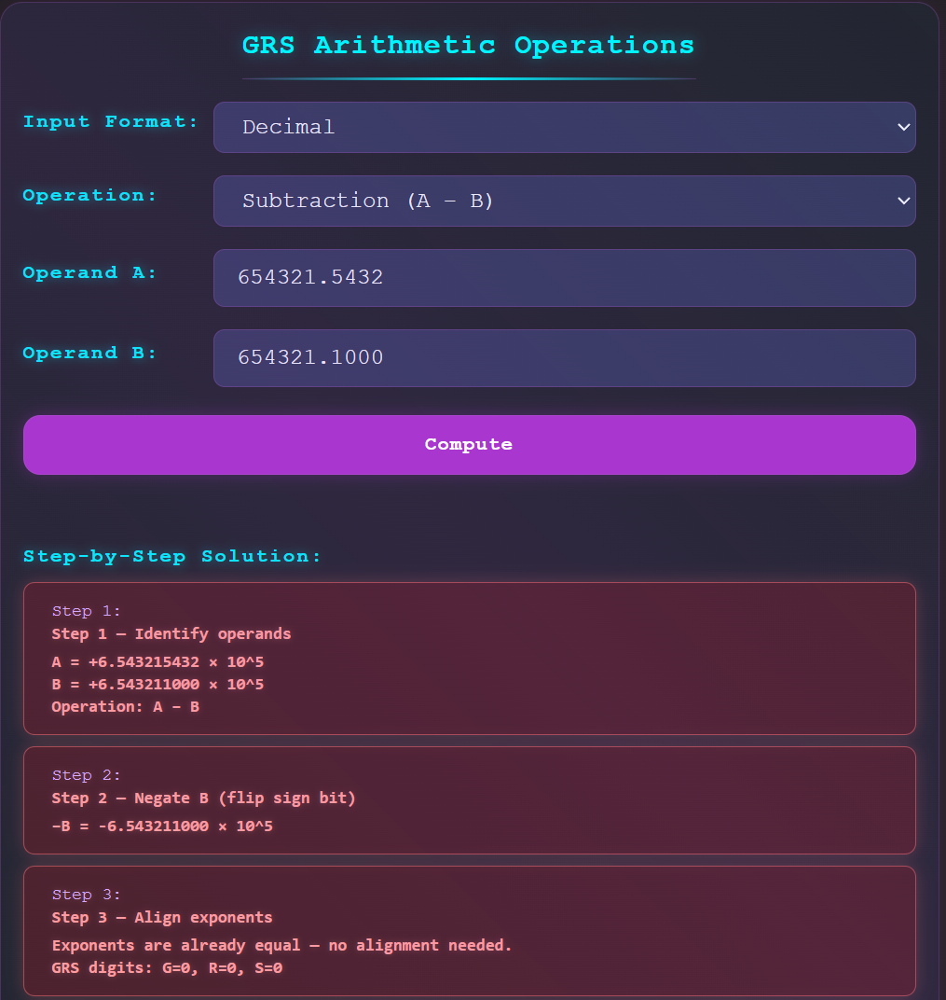<br>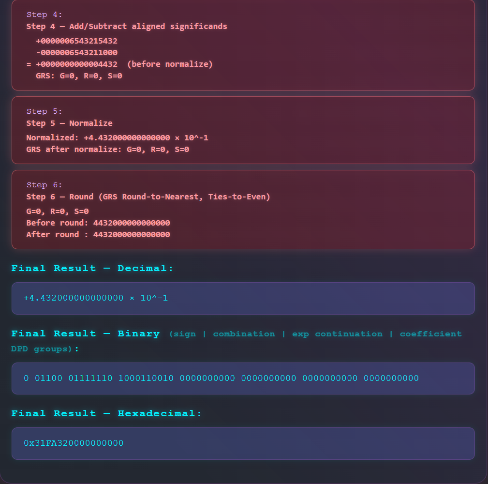 |
| **Hexadecimal Subtraction Input**     | `Input Format: Hexadecimal`<br>`Operation: Subtraction`<br>`Operand A: 3A12C34563200000`<br>`Operand B: 3A12C34440000000` | 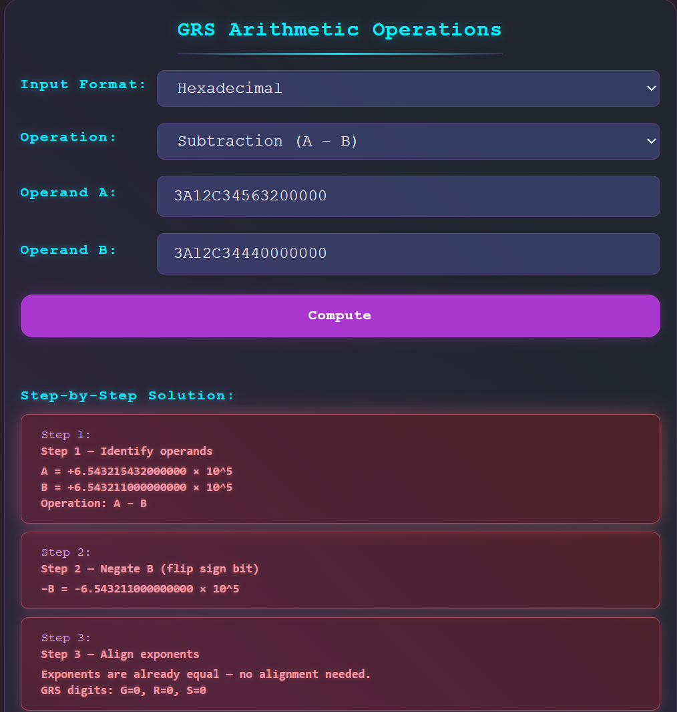<br>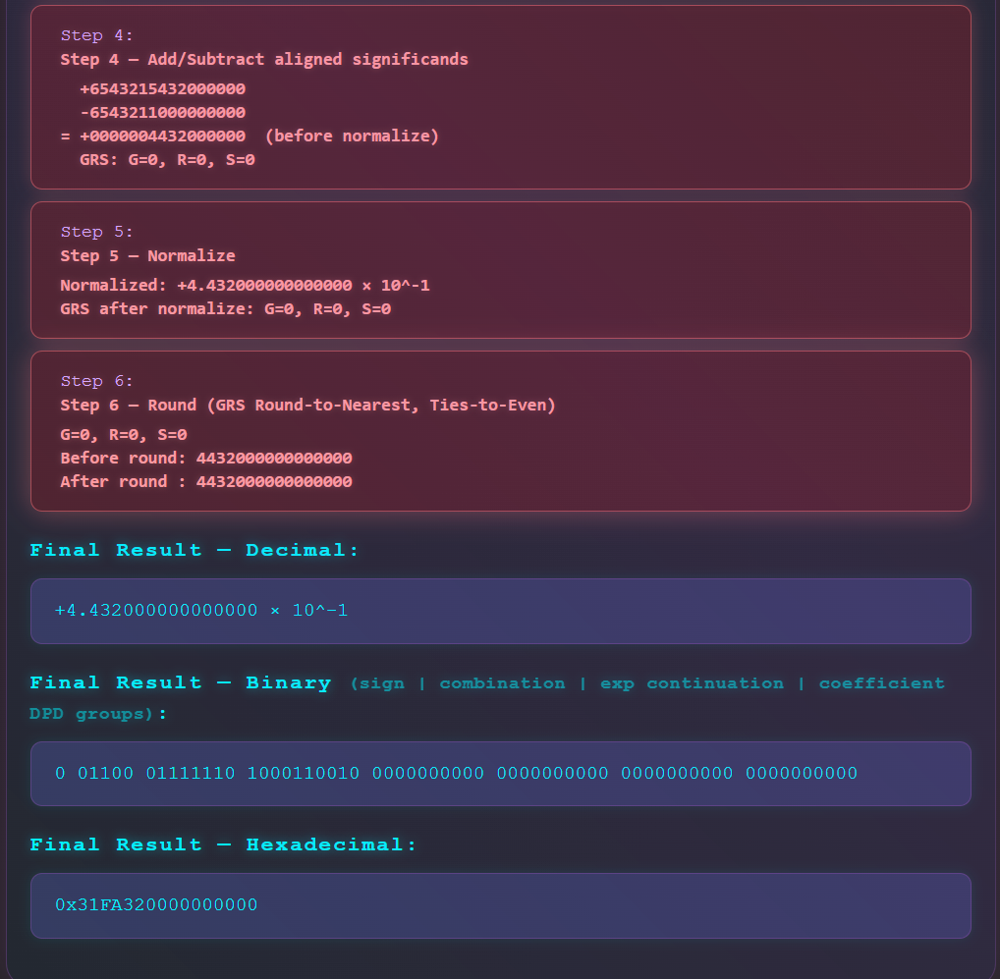 |
| **Decimal Division Input**            | `Input Format: Decimal`<br>`Operation: Division`<br>`Operand A: 22`<br>`Operand B: 7`                                     | 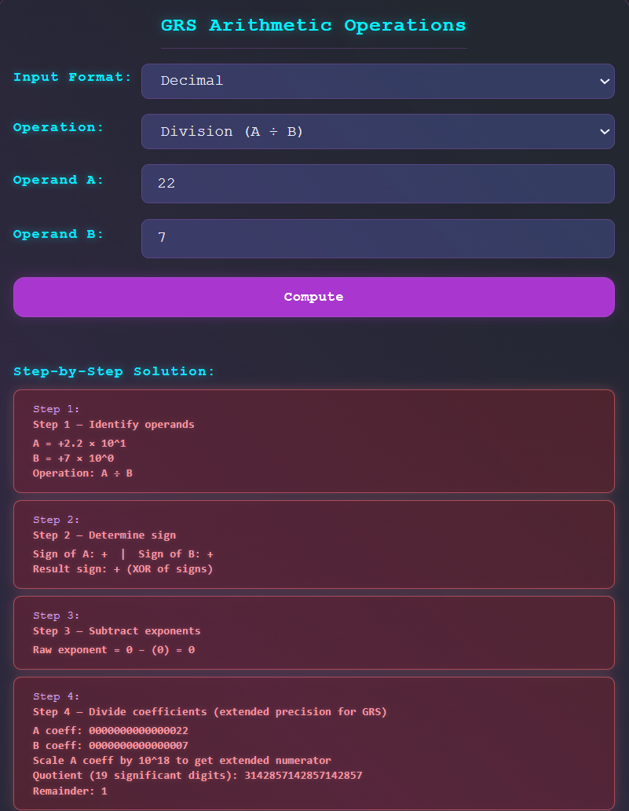<br>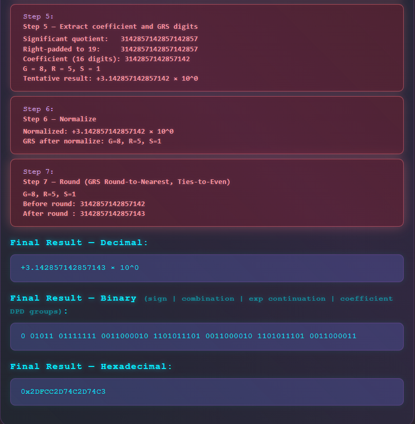 |
| **Hexadecimal Division Input**        | `Input Format: Hexadecimal`<br>`Operation: Division`<br>`Operand A: 2A01000000000000`<br>`Operand B: 3DFC000000000000`    | 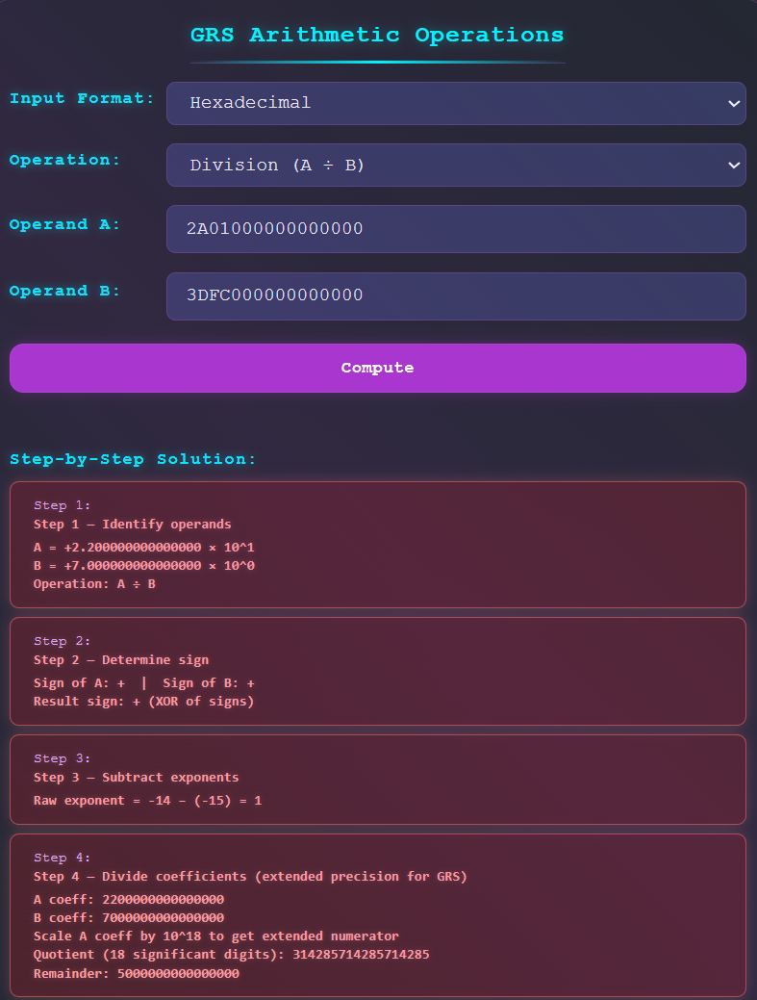<br>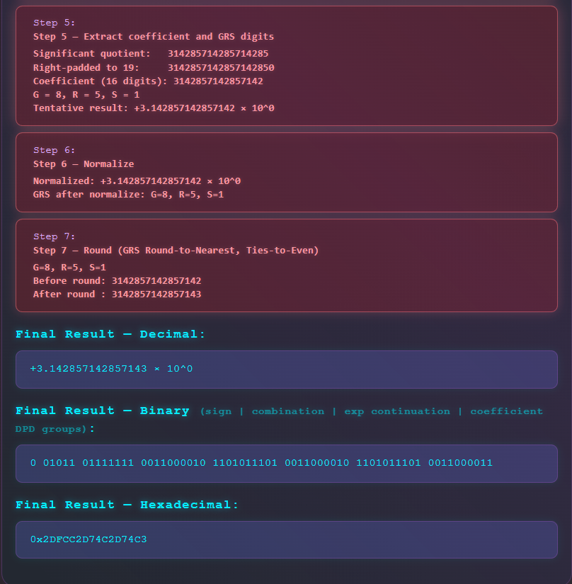 |
| **Number Subtracted by Itself Input** | `Input Format: Decimal`<br>`Operation: Subtraction`<br>`Operand A: 1`<br>`Operand B: 1`                                   | 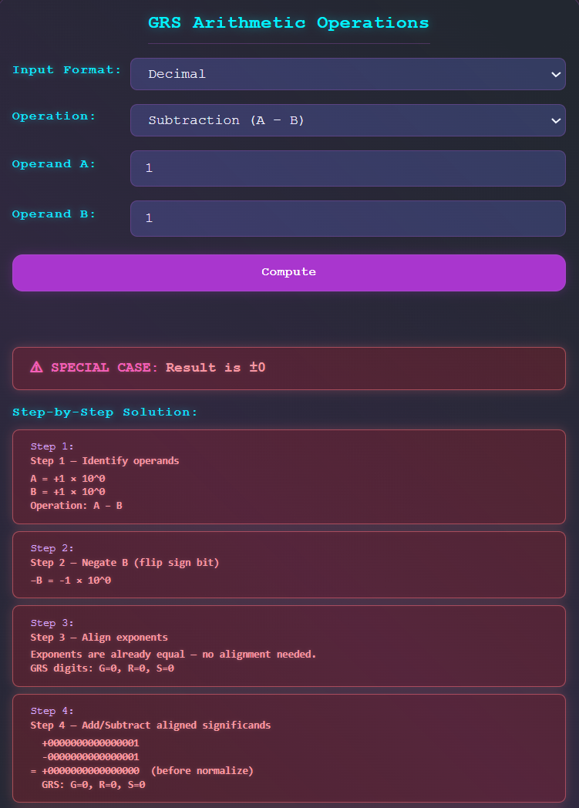<br>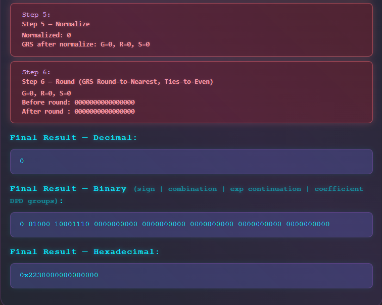 |
| **Zero Divided by Any Number Input**  | `Input Format: Decimal`<br>`Operation: Division`<br>`Operand A: 0`<br>`Operand B: 1`                                      |                                  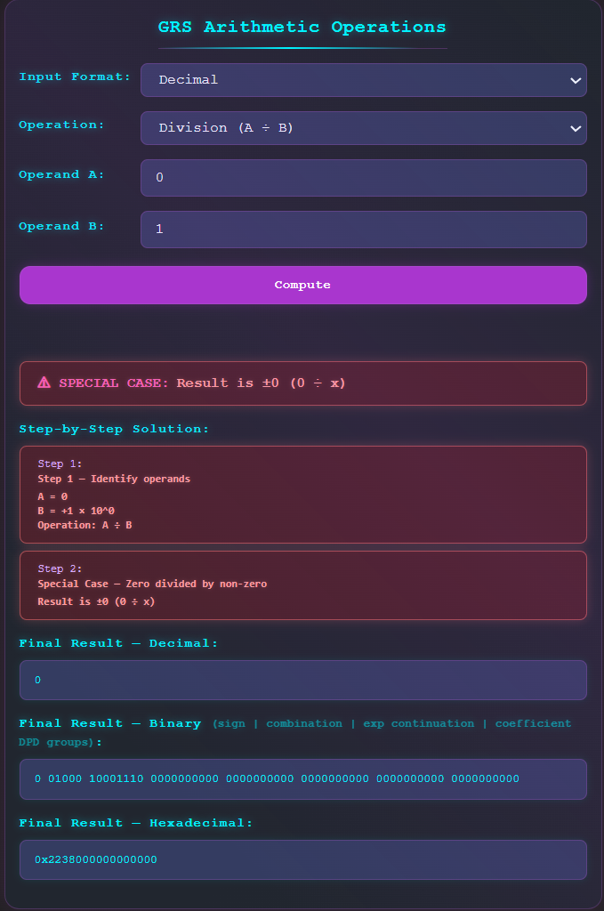                                   |
| **Any Number Divided by Zero Input**  | `Input Format: Decimal`<br>`Operation: Division`<br>`Operand A: 1`<br>`Operand B: 0`                                      |                                  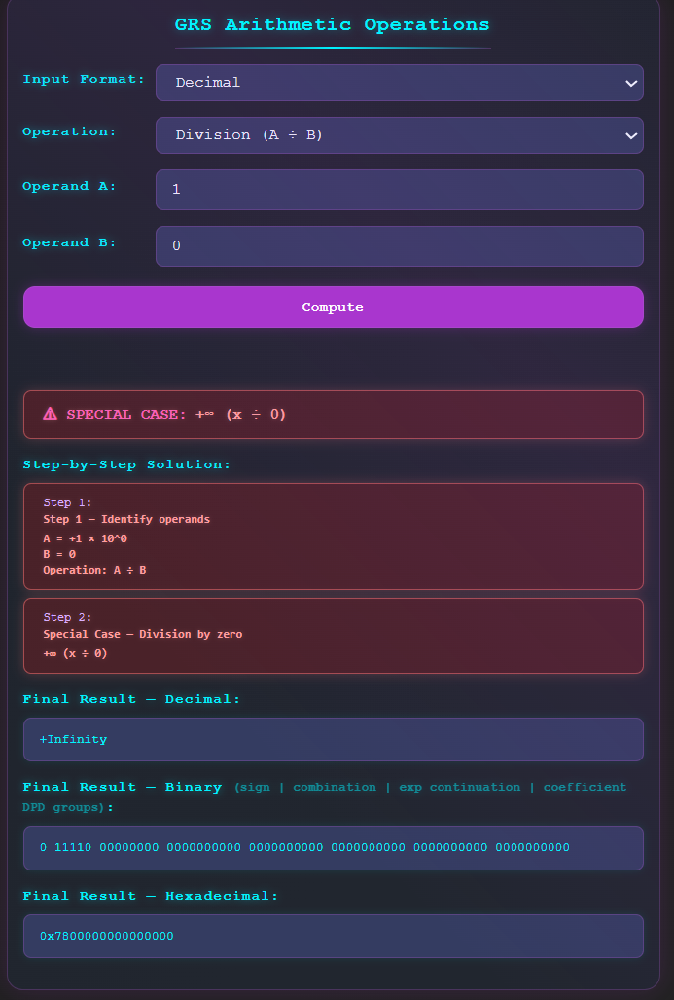                                   |

## Current Implementation

**Done:**

- Working Vite/React site, cyberpunk styling via Tailwind
- Full decimal64 encoding (sign, combination field, 398 bias, DPD compression)
- Converter special cases: NaN, ±Infinity, underflow to ±0
- All 4 rounding methods, for both decimal and binary input
- GRS subtraction and division, with complete step traces and ties-to-even
  rounding
- Arithmetic special cases: NaN propagation, `∞ − ∞`, `0 ÷ 0`, `x ÷ 0`,
  `finite ÷ ∞`, overflow, underflow
- Both decimal and hex operand formats for arithmetic
- Inline validation that doesn't wipe your input
- Arithmetic engine kept separate from the React layer
- `npm run lint` and `npm run build` both pass clean

**Not done yet / known gaps:**

- Converter truncates coefficients over 16 digits rather than rounding them
- Only subtraction and division are implemented — no addition or
  multiplication
- Arithmetic only takes decimal or IEEE-hex input, no binary
- Hex operands have to be exactly 16 characters, no shorter/longer forms
- No animation between steps — you just see the finished state tables
- Need to double check the repo's visibility before we submit

---
